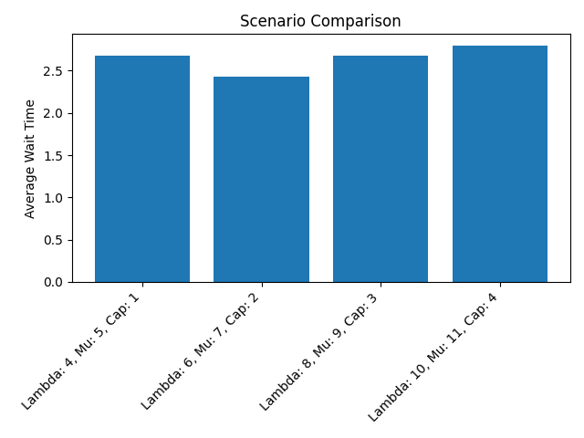

📊 Monte Carlo Simulation of Queueing System
  	This project simulates a discrete event-based queueing system using SimPy, with the goal of evaluating average wait times under various system configurations. A Monte Carlo approach is used to ensure robustness of results.

📁 Project Structure
	  ├── simulation_code.py         # Main simulation script
	  ├── scenario_comparison.png    # Output bar chart comparing average wait times
	  ├── simulation_report.pdf      # Optional detailed report of the simulation
	  └── .idea/                     # IDE configuration files (can be ignored)
🧠 Description
	  The system simulates the arrival and service of packets in a server environment with varying parameters:
	  
	  Arrival Rate (λ): The frequency at which packets arrive.
	  
	  Service Rate (μ): The speed at which packets are processed.
	  
	  Server Capacity: Number of servers available to process packets.
	  
	  Monte Carlo Runs: Number of simulations to average out randomness.
	  
	  Simulation Time: Total time units to simulate each scenario.
	  
	  A bar chart is generated to compare the average wait times for each configuration.

📦 Dependencies
	  Make sure you have the following Python packages installed:
	  
	  pip install simpy numpy matplotlib
🚀 How to Run
	  Simply execute the script:
	  python simulation_code.py
	  It will:
	
	    Run simulations with different parameter sets
	    
	    Print results to the console
	    
	    Generate a plot: scenario_comparison.png

📈 Output
	  A bar chart visualizing average wait times for each (λ, μ, capacity) scenario.
	  
	  Helps in evaluating how increasing capacity or changing arrival/service rates impacts system performance.

📊 Sample Chart
  	
✍️ Author
	  Youssef Khalifa
	  GitHub: @youssefkhalifa04

